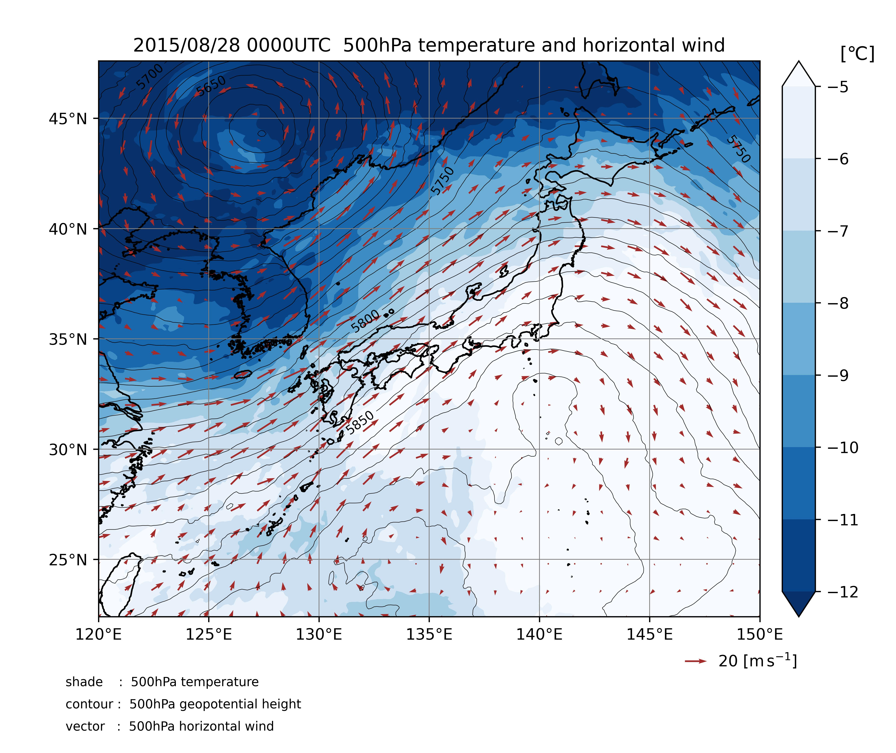

# MSM Visualizer
3時間毎の大気環境場図を作成します。




# 仮想環境のactivate
```
python3 -m venv .venv
```

```
#Unix
source .venv/bin/activate
#Windows
source .venv/Scripts/activate
```

# Installation
パッケージのインストール
```
pip install -r requirements.txt
```


# Usage
`src/constants/configuration.py`で描画変数等を設定、<br>
`src/main.py`で描画する日付(UTC)を指定したのち、
```
python src/main.py
```
を実行して、図を作成します。<br>
作成された図は `img`下に出力されます。
 
# Features
- ### 機能
   任意の日付の大気環境場について図を作成することができます。作図できる物理変数は、水平風、気温、相対湿度、ジオポテンシャル高度、海面校正気圧など様々です。また、地上の環境場に限らず、気圧面を指定して描画することができます。これにより、大気の風の流れや気温分布、低気圧などの擾乱の発達の様子を視覚的に捉えることができます。
   
- ### 使用データ
   大気環境場のデータは、気象庁メソ数値予報モデルGPVを用いています。[仕様はこちら](https://www.jmbsc.or.jp/jp/online/file/f-online10200.html)<br>
   実際に描画に用いているものは[京都大学生存圏データベース](http://database.rish.kyoto-u.ac.jp/arch/jmadata/data/gpv/netcdf/README)の配信データです。

 
 
# Note
描画できる変数名については `data/information`下を参照してください。また、図の詳細な設定を変更したい場合は `src/constants/constant.py`の値を変更してください。
<br> 
<br>

